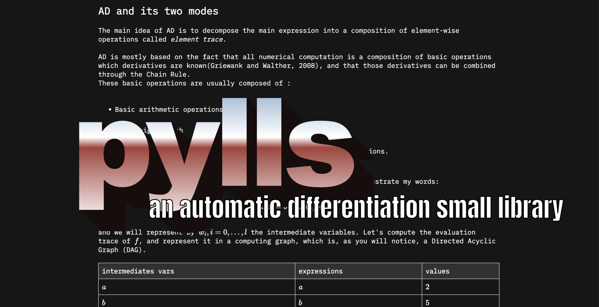

# pylls

<iframe src="https://ghbtns.com/github-btn.html?user=twbs&repo=bootstrap&type=star&count=true" frameborder="0" scrolling="0" width="150" height="20" title="GitHub"></iframe>

pylls is a small deep learning library aimed to study purpose and understand the basic architecture of more massives frameworks.
inspired by [micrograd](https://github.com/karpathy/micrograd/tree/master) and [pytorch](https://github.com/pytorch/pytorch), this still a wip, feel free to contribute to it with some code or advocacy ;).
the current longterm goal is to make an easy and fast to use library in some "hacking" contexts like hackthons ! 

currently finishing to think the overall structure of the project. soon rotating to convnet blocks.

 
